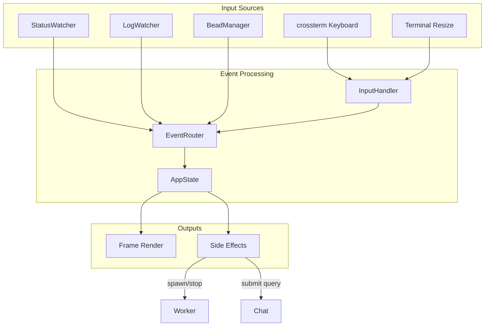
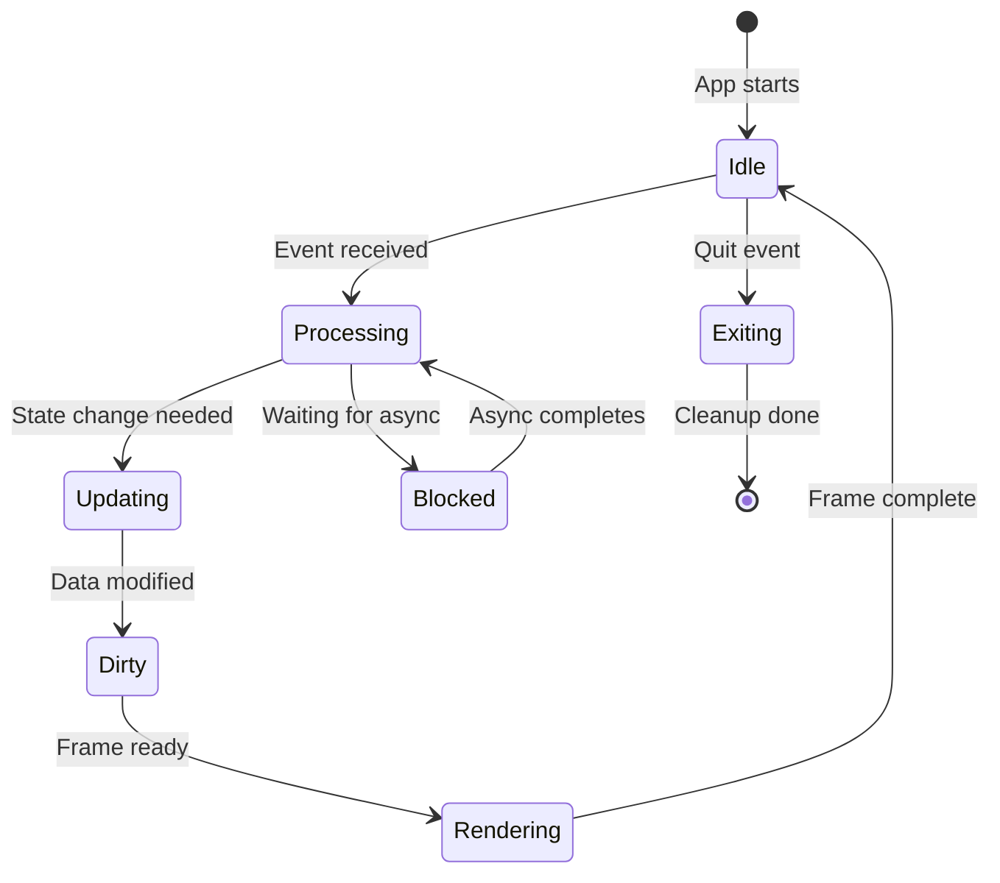
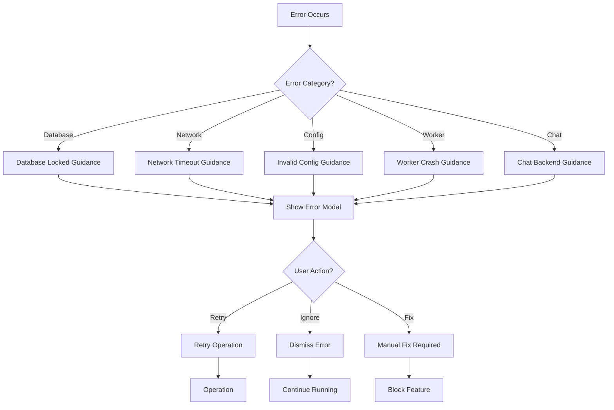

# FORGE Events System

## Overview

FORGE uses an event-driven architecture for handling user input, state changes, and external updates. The event system bridges synchronous terminal I/O with asynchronous background operations.

## Event Flow Architecture



## Event Types

### AppEvent

The main event enum represents all application-level actions:

```rust
pub enum AppEvent {
    // View navigation
    SwitchView(View),
    NextView,
    PrevView,

    // Help
    ShowHelp,
    HideHelp,

    // Application
    Quit,
    ForceQuit,     // Ctrl+C
    Refresh,        // Ctrl+L
    Cancel,
    Update,         // Ctrl+U

    // Navigation
    NavigateUp,
    NavigateDown,
    PageUp,
    PageDown,
    GoToTop,
    GoToBottom,

    // Selection
    Select,
    Toggle,

    // Focus
    FocusNext,
    FocusPrev,

    // Text input
    TextInput(char),
    Backspace,
    Submit,

    // Worker actions
    SpawnWorker(WorkerExecutor),
    KillWorker,
    PauseWorker,
    PauseAllWorkers,
    ResumeWorker,
    ResumeAllWorkers,

    // Configuration
    OpenConfig,
    OpenBudgetConfig,
    OpenWorkerConfig,
    CycleTheme,

    // Alerts
    AcknowledgeAlert,
    AcknowledgeAllAlerts,

    // No-op
    None,
}
```

## Input Handling

### InputHandler

The `InputHandler` converts raw key events into `AppEvent`:

```rust
pub struct InputHandler {
    chat_mode: bool,
    current_view: View,
}

impl InputHandler {
    pub fn handle_key(&mut self, key: KeyEvent) -> AppEvent {
        // Mode-aware key mapping
        if self.chat_mode {
            self.handle_chat_input(key)
        } else {
            self.handle_normal_mode(key)
        }
    }
}
```

### Key Event Categories

**Global Keys (work in all modes):**
- `Ctrl+C` → ForceQuit
- `Ctrl+L` → Refresh
- `Ctrl+U` → Update
- `Esc` → Cancel/exit mode

**Navigation Mode Keys:**
- View hotkeys: `o`, `w`, `t`, `c`, `m`, `l`, `u`, `a`
- Worker spawn: `g` (GLM), `s` (Sonnet), `o` (Opus), `h` (Haiku)
- Worker control: `k` (kill), `p` (pause), `r` (resume)
- Navigation: `j`/`↓`, `↑`, `PgUp`, `PgDn`, `Home`, `End`
- Selection: `Enter`, `Space`
- Chat: `:`

**Chat Mode Keys:**
- `Enter` → Submit
- `Backspace` → Delete
- `↑`/`↓` → Navigate history
- All other → Text input

## State Updates

### State Flow



### Dirty Flag Pattern

```rust
pub struct App {
    dirty: bool,
    // ... other fields
}

impl App {
    pub fn handle_event(&mut self, event: AppEvent) {
        match event {
            AppEvent::NavigateUp => {
                self.selected_idx = self.selected_idx.saturating_sub(1);
                self.dirty = true;  // Trigger redraw
            }
            _ => {}
        }
    }

    pub fn render(&mut self, terminal: &mut Terminal) {
        if self.dirty {
            self.draw_frame(terminal)?;
            self.dirty = false;
        }
    }
}
```

## Background Events

### StatusWatcher Events

File system events trigger UI updates:

```rust
pub enum StatusEvent {
    WorkerStarted(WorkerId),
    WorkerUpdated(WorkerId, WorkerStatusInfo),
    WorkerStopped(WorkerId),
    WorkerFailed(WorkerId, String),
}

impl StatusWatcher {
    pub fn watch(&mut self) -> Receiver<StatusEvent> {
        let (tx, rx) = mpsc::channel();
        // Spawn watcher thread that sends events
        rx
    }
}
```

### LogWatcher Events

Log file changes generate activity events:

```rust
pub enum LogWatcherEvent {
    NewLogEntry(LogEntry),
    LogRotated,
    WorkerLogCreated(WorkerId),
}

pub struct LogEntry {
    pub timestamp: DateTime<Utc>,
    pub level: LogLevel,
    pub message: String,
    pub worker_id: Option<String>,
}
```

### BeadManager Events

Task queue updates from beads CLI:

```rust
pub enum BeadEvent {
    QueueUpdated(Vec<Bead>),
    BeadAssigned(BeadId, WorkerId),
    BeadCompleted(BeadId),
    BeadBlocked(BeadId, Vec<BeadId>),
}
```

## Event Loop

### Main Loop Structure

```rust
pub fn run(&mut self) -> AppResult<()> {
    loop {
        // 1. Poll for events (with timeout)
        let event = self.poll_events(Duration::from_millis(50))?;

        // 2. Handle event
        self.handle_app_event(event)?;

        // 3. Check background sources
        self.check_background_events()?;

        // 4. Update state
        self.update_state()?;

        // 5. Render if dirty
        if self.dirty {
            self.render_frame()?;
        }

        // 6. Check for quit
        if self.should_quit {
            return Ok(());
        }
    }
}
```

### Polling Strategy

```rust
fn poll_events(&mut self, timeout: Duration)
    -> Result<AppEvent>
{
    // Priority 1: Keyboard input (blocking with timeout)
    if let Ok(event) = crossterm::event::poll(timeout) {
        return Ok(self.input_handler.handle_key(event));
    }

    // Priority 2: Check channels (non-blocking)
    if let Ok(StatusEvent::WorkerUpdated(id, info)) =
        self.status_rx.try_recv()
    {
        return Ok(AppEvent::WorkerUpdated(id, info));
    }

    // Priority 3: Check async responses
    if let Ok(response) = self.chat_rx.try_recv() {
        return Ok(AppEvent::ChatResponse(response));
    }

    // No events
    Ok(AppEvent::None)
}
```

## View-Specific Events

### Workers View

| Key | Action | Event |
|-----|--------|--------|
| `p` | Pause selected worker | `PauseWorker` |
| `P` | Pause all workers | `PauseAllWorkers` |
| `r` | Resume selected worker | `ResumeWorker` |
| `R` | Resume all workers | `ResumeAllWorkers` |
| `k` | Kill selected worker | `KillWorker` |
| `g`/`s`/`o`/`h` | Spawn new worker | `SpawnWorker(...)` |

### Alerts View

| Key | Action | Event |
|-----|--------|--------|
| `Enter` | Acknowledge selected alert | `AcknowledgeAlert` |
| `A` | Acknowledge all alerts | `AcknowledgeAllAlerts` |
| `a` | Switch to Alerts view | `SwitchView(Alerts)` |

### Chat View

| Key | Action | Event |
|-----|--------|--------|
| `Enter` | Submit query | `Submit` |
| `Esc` | Cancel/close chat | `Cancel` |
| `↑`/`↓` | Navigate history | `NavigateUp`/`Down` |
| Any char | Append to input | `TextInput(c)` |

## Error Recovery Events

### Error Recovery Flow



### Recovery Events

```rust
pub enum RecoveryAction {
    Retry(Operation),
    Dismiss,
    BlockFeature(String),
    ShowManual(String),
}
```

## Async Bridge

### Message Channels

Communication between async backend and sync UI:

```rust
// In App struct
chat_tx: mpsc::Sender<ChatRequest>,
chat_rx: mpsc::Receiver<ChatResponse>,
chat_pending: bool,
```

### Chat Request Flow

```rust
// Submit request (non-blocking)
pub fn submit_chat(&mut self, query: String) -> AppResult<()> {
    self.chat_tx.send(ChatRequest {
        query,
        context: self.get_dashboard_context(),
    })?;
    self.chat_pending = true;
    self.dirty = true;
    Ok(())
}

// Check for response each frame
pub fn poll_chat_response(&mut self) {
    if let Ok(response) = self.chat_rx.try_recv() {
        self.chat_pending = false;
        self.chat_history.push(response);
        self.dirty = true;
    }
}
```

## Timing Considerations

### Event Processing Targets

| Operation | Target | Notes |
|------------|--------|-------|
| Key press → Event | < 1ms | Direct mapping |
| State update | < 5ms | In-memory changes |
| Frame render | < 16ms | 60 FPS target |
| Background poll | 50ms timeout | Balance responsiveness/CPU |

### Latency Sources

1. **Tmux discovery**: ~200-500ms (external process)
2. **Beads CLI**: ~100-200ms (subprocess with timeout)
3. **Database queries**: ~10-50ms (SQLite)
4. **Log file reads**: ~5-20ms (file I/O)
5. **Chat API**: Variable (network, can be seconds)

## Performance Optimization

### Event Batching

```rust
// Batch multiple updates into single render
pub fn batch_update(&mut self, updates: Vec<Update>) {
    for update in updates {
        self.apply_update(update);
    }
    self.dirty = true;  // Single redraw
}
```

### Lazy Evaluation

```rust
// Only compute when needed
pub fn get_expensive_metric(&mut self) -> Metric {
    if self.cached_metric.is_none() {
        self.cached_metric = Some(self.compute_metric());
    }
    self.cached_metric.unwrap()
}
```

### Debouncing

```rust
// Debounce rapid events
const DEBOUNCE_MS: u64 = 100;

if self.last_event.elapsed() < DEBOUNCE_MS {
    return;  // Skip event
}
self.last_event = Instant::now();
```

## Related Documentation

- [Architecture](./ARCHITECTURE.md) - System design
- [UI Architecture](./UI.md) - TUI details
- [Workers](./WORKERS.md) - Worker lifecycle
