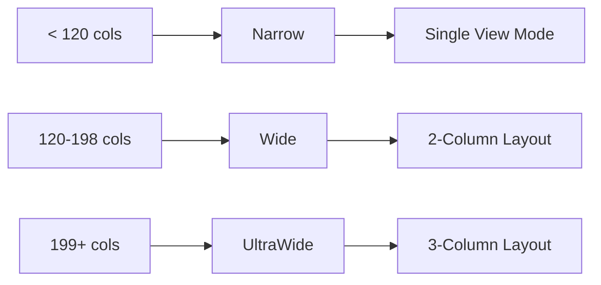

# FORGE TUI Architecture

## Overview

FORGE uses the ratatui framework for its Terminal User Interface (TUI). The UI is organized into multiple views, each providing specialized functionality for monitoring and controlling AI workers, tasks, costs, and system health.

## TUI Stack

```
┌─────────────────────────────────────────────────────────────┐
│                         Application Layer                      │
│  ┌─────────────────────────────────────────────────────────────┐  │
│  │                      forge-tui (App)                 │  │
│  └───────────────────────┬─────────────────────────────────┘  │
│                            │                                        │
│  ┌─────────────────────────┼─────────────────────────────────────┐  │
│  │         View Layer    │                                 │  │
│  │  ┌───────────┬───────────┬───────────┬───────────┐ │  │
│  │  │ Overview  │  Workers  │   Tasks   │   Costs   │ │  │
│  │  └───────────┴───────────┴───────────┴───────────┘ │  │
│  │  ┌───────────┬───────────┬───────────────────────┐ │  │
│  │  │ Metrics   │   Logs    │  Chat                 │ │  │
│  │  └───────────┴───────────┴───────────────────────┘ │  │
│  └─────────────────────┼─────────────────────────────────────────┘  │
│                        │                                        │
│  ┌─────────────────────────────────────────────────────────────┐  │
│  │         Widget Layer                                   │  │
│  │  Sparkline, ProgressBar, HotkeyHints, StatusIndicator   │  │
│  └─────────────────────────────────────────────────────────────┘  │
└───────────────────────┬─────────────────────────────────────────────┘
                         │
┌─────────────────────────┼─────────────────────────────────────────────┐
│         Framework Layer  │                                      │
│  ┌─────────────────────────────────────────────────────────────┐ │
│  │  ratatui 0.29 + crossterm 0.28                │ │
│  │  - Layout system                                        │ │
│  │  - Widget primitives                                   │ │
│  │  - Event handling                                     │ │
│  │  - Styling                                           │ │
│  └─────────────────────────────────────────────────────────────┘ │
└─────────────────────────────────────────────────────────────────────────┘
```

## View System

### Available Views

```rust
pub enum View {
    Overview,      // Dashboard summary
    Workers,       // Worker pool management
    Tasks,         // Bead/task queue
    Costs,         // Cost analytics
    Metrics,       // Performance metrics
    Logs,          // Activity log viewer
    Subscriptions, // Subscription tracking
    Alerts,        // Health alerts
    Chat,          // Conversational interface
}
```

### View Navigation

**Hotkeys:**
- `o` - Overview
- `w` - Workers
- `t` - Tasks
- `c` - Costs
- `m` - Metrics
- `l` - Logs
- `u` - Subscriptions
- `a` - Alerts
- `:` - Chat
- `Tab` - Next view
- `Shift+Tab` - Previous view

**View Cycling Order:**
```
Overview → Workers → Tasks → Costs → Metrics → Logs → Subscriptions → Alerts → Chat → Overview
```

## Layout Modes

### Responsive Design

The TUI adapts to terminal dimensions:



### Layout Specifications

| Mode | Width | Columns | Panels Visible | Min Height |
|-------|--------|----------|----------------|-------------|
| Narrow | < 120 | 1 | Single view only | 20 |
| Wide | 120-198 | 2 | 4 panels | 30 |
| UltraWide | 199+ | 3 | 6 panels | 38 |

### Layout Detection

```rust
pub fn from_width(width: u16) -> LayoutMode {
    if width >= 199 {
        LayoutMode::UltraWide
    } else if width >= 120 {
        LayoutMode::Wide
    } else {
        LayoutMode::Narrow
    }
}
```

### UltraWide Layout (199+ cols)

```
┌────────────────────────────────────────────────────────────────────────────────────────────────┐
│ FORGE                                                                 [?] Help [q] Quit │
├──────────┬────────────────┬────────────────┬────────────────┬────────────────┬────────────────┤
│ Workers │   Subscriptions │      Tasks     │    Activity    │     Costs      │     Alerts      │
│ Panel  │      Panel      │      Panel      │      Panel      │      Panel      │      Panel      │
└──────────┴────────────────┴────────────────┴────────────────┴────────────────┴────────────────┘
```

### Wide Layout (120-198 cols)

```
┌────────────────────────────────────────────────────────────────────────────────────────────────┐
│ FORGE                                                    [?] Help [q] Quit    │
├──────────────────────────────┬───────────────────────────────────────────────────────────┤
│       Workers Panel        │              Tasks Panel                            │
│                          │                                                       │
│                          │              Activity Log                            │
├──────────────────────────────┴───────────────────────────────────────────────────────────┤
│       Subscriptions       │              Cost Panel                              │
└──────────────────────────────┴───────────────────────────────────────────────────────────┘
```

### Narrow Layout (< 120 cols)

```
┌────────────────────────────────────────────────────────────────────────────────────────────────┐
│ FORGE                                                       [?] Help [q] Quit │
├────────────────────────────────────────────────────────────────────────────────────────────────┤
│                                                                              │
│                          Workers Panel                                            │
│                                                                              │
│                                                                              │
└────────────────────────────────────────────────────────────────────────────────────────────────┘
```

## Panel Components

### Worker Panel

```
┌────────────────────────────────────────────────┐
│ Workers (4)                      [g][s][o][h]│
├────────────────────────────────────────────────┤
│ ✅ claude-sonnet-alpha  │ Active   │
│    fg-123: Implement feature          │
│    Tier: Standard                    │
│ 💤 claude-opus-bravo    │ Idle     │
│    No current task                  │
│ 💤 claude-haiku-charlie  │ Idle     │
│    Tier: Budget                     │
│ ⏸️  claude-sonnet-delta  │ Paused   │
└────────────────────────────────────────────────┘
```

### Task Panel

```
┌────────────────────────────────────────────────┐
│ Tasks (12 ready)                    [t] View │
├────────────────────────────────────────────────┤
│ P0 │ fg-124 │ Fix auth bug           │
│ P1 │ fg-125 │ Add feature            │
│ P2 │ fg-126 │ Update docs           │
│    │ fg-127 │ ⛔ blocked by fg-124 │
└────────────────────────────────────────────────┘
```

### Cost Panel

```
┌────────────────────────────────────────────────┐
│ Costs                                   [b] Budget│
├────────────────────────────────────────────────┤
│ Today:          $2.45 / $10.00 (24%) │
│ This Month:      $45.67 / $100.00      │
│                                         │
│ By Model:                               │
│ ┌────────────────────────────────────┐       │
│ │ Sonnet  │ $23.45 │  51%       │       │
│ │ Opus    │ $18.67 │  41%       │       │
│ │ Haiku   │ $3.55  │ 8%        │       │
│ └────────────────────────────────────┘       │
└────────────────────────────────────────────────┘
```

### Metrics Panel

```
┌────────────────────────────────────────────────┐
│ Metrics                                 [m] Details│
├────────────────────────────────────────────────┤
│ Total API Calls:     1,234            │
│ Avg Response Time:  2.3s             │
│ Cache Hit Rate:     34%                │
│                                         │
│ Calls/min (24h):                       │
│ ▁▃▄▅▇█                              │
│                                         │
│ Worker Efficiency:                        │
│ ┌────────────────────────────────────┐       │
│ │ alpha │ ████████░░  82%       │       │
│ │ bravo │ ██████░░░░  67%       │       │
│ └────────────────────────────────────┘       │
└────────────────────────────────────────────────┘
```

### Activity Log Panel

```
┌────────────────────────────────────────────────┐
│ Activity Log (last 50)                        │
├────────────────────────────────────────────────┤
│ 10:35:21 ─ ✅ Worker started: alpha   │
│ 10:34:15 ─ 📝 Task assigned: fg-123│
│ 10:32:08 ─ 💰 Status: idle         │
│ 10:30:00 ─ 🔄 Spawned worker       │
└────────────────────────────────────────────────┘
```

### Alerts Panel

```
┌────────────────────────────────────────────────┐
│ Alerts (2)                              [A] Ack All│
├────────────────────────────────────────────────┤
│ ⚠️  Worker failed: claude-opus-bravo │
│     Crash detected at 10:45:23            │
│     [Enter] to acknowledge                │
├────────────────────────────────────────────────┤
│ 📊  Budget warning: 80% spent           │
│     $8.00 of $10.00 used today           │
│     [Enter] to dismiss                   │
└────────────────────────────────────────────────┘
```

## Chat Interface

### Chat View

```
┌────────────────────────────────────────────────┐
│ Chat                                           │
├────────────────────────────────────────────────┤
│ User: Why is glm-delta idle?            │
│                                         │
│ Assistant: GLM-delta is idle because:       │
│ 1. No tasks assigned to it              │
│ 2. It finished its last task            │
│ 3. It's paused (press 'r' to resume) │
│                                         │
│ Would you like me to assign a task?       │
│                                         │
├────────────────────────────────────────────────┤
│ > Why is sonnet-alpha slow?              │
│                                         │
│ [↑/↓] History | [Enter] Send | [Esc] Cancel│
└────────────────────────────────────────────────┘
```

### Chat Mode Features

- **Command processing**: Natural language to tool calls
- **History navigation**: Up/down arrows for previous queries
- **Context injection**: Dashboard state auto-included
- **Action confirmation**: Destructive actions require user approval

## Widget Library

### Sparkline Widget

Mini bar charts for metrics display:

```rust
use forge_tui::SparklineWidget;

let sparkline = SparklineWidget::default()
    .direction(SparklineDirection::Horizontal)
    .style(ProgressFillStyle::Braille)
    .length(20);

// Data: [1, 3, 5, 8, 6, 4, 7]
// Render: ▂▄▅█▇▃
```

### Progress Bar

Configurable progress indicators:

```rust
use forge_tui::ProgressBar;

let bar = ProgressBar::default()
    .with_total(100)
    .with_current(65)
    .with_style(ProgressFillStyle::Blocks);

// Render: █████████████████░░░░░░░░░ 65%
```

### Hotkey Hints

Styled key display:

```rust
use forge_tui::HotkeyHints;

let hints = HotkeyHints::new(&[
    ("w", "Workers"),
    ("t", "Tasks"),
    ("q", "Quit"),
]);

// Render: [w] Workers [t] Tasks [q] Quit
```

### Status Indicator

Worker status icons:

```rust
use forge_tui::StatusIndicator;

let status = StatusIndicator::from(WorkerStatus::Active);
// Render: ✅ Active
```

## Theme System

### Available Themes

```rust
pub enum ThemeName {
    Dark,        // Default dark theme
    Light,       // Light background
    Cyberpunk,   // Neon colors
    Forest,      // Green tones
    Ocean,       // Blue palette
    Monokai,     // Classic editor colors
}
```

### Theme Colors

```rust
pub struct ThemeColors {
    // UI colors
    pub primary: Color,
    pub secondary: Color,
    pub background: Color,
    pub foreground: Color,

    // Status colors
    pub success: Color,
    pub warning: Color,
    pub error: Color,
    pub info: Color,

    // Component colors
    pub border: Color,
    pub highlight: Color,
    pub muted: Color,
}
```

### Theme Switching

Hotkey: `C` (uppercase C) cycles themes

```rust
impl ThemeManager {
    pub fn cycle_theme(&mut self) {
        self.current = match self.current {
            ThemeName::Dark => ThemeName::Light,
            ThemeName::Light => ThemeName::Cyberpunk,
            ThemeName::Cyberpunk => ThemeName::Forest,
            ThemeName::Forest => ThemeName::Ocean,
            ThemeName::Ocean => ThemeName::Monokai,
            ThemeName::Monokai => ThemeName::Dark,
        };
    }
}
```

## Rendering Pipeline

### Frame Structure

```
┌────────────────────────────────────────────────┐
│ Header (Title + Hotkeys)                   │ ← 100 cols max
├────────────────────────────────────────────────┤
│                                          │
│               Body Area                      │ ← Scrollable
│               (Panels)                      │
│                                          │
├────────────────────────────────────────────────┤
│ Status Bar (Hints + Shortcuts)          │
└────────────────────────────────────────────────┘
```

### Rendering Process

```rust
pub fn render_frame(&mut self, terminal: &mut Terminal)
    -> AppResult<()>
{
    // 1. Lock terminal
    let _lock = terminal.lock()?;

    // 2. Get terminal size
    let size = terminal.size()?;

    // 3. Clear and reset cursor
    terminal.clear()?;
    terminal.hide_cursor()?;

    // 4. Draw header
    self.draw_header(terminal, size.width)?;

    // 5. Draw body (current view)
    match self.current_view {
        View::Overview => self.draw_overview_view(terminal, size)?,
        View::Workers => self.draw_workers_view(terminal, size)?,
        // ... other views
    }

    // 6. Draw status bar
    self.draw_status_bar(terminal, size.width)?;

    // 7. Flush
    terminal.flush()?;
    Ok(())
}
```

### Performance Optimization

**Dirty Flag:**
- Only redraw when state changes
- Avoids unnecessary terminal I/O

**Partial Updates:**
- Re-render only affected panels
- Minimizes flicker

**Caching:**
- Pre-compute panel layouts
- Cache expensive calculations

## Status Bar

### Status Bar Components

```
┌────────────────────────────────────────────────────────────────┐
│ [o] Overview [w] Workers [t] Tasks [...] [?] Help│
└────────────────────────────────────────────────────────────────┘
│       │                            │                │
│       │                            │                └─ Hotkey hints
│       │                            └─ Current view indicator
│       └─ View navigation hotkeys
```

### Dynamic Elements

- **View title**: Current view name
- **Hotkey hints**: Context-sensitive shortcuts
- **Alert count**: Unacknowledged alert badge
- **Chat mode indicator**: Shows when chat is active
- **Connection status**: Backend health indicator

## Accessibility

### Keyboard Navigation

- **Vim-style**: `j`/`k` for down/up
- **Arrow keys**: Alternative navigation
- **Home/End**: Jump to top/bottom
- **PgUp/PgDn**: Scroll by page
- **Tab/Shift+Tab**: Cycle views

### Visual Clarity

- **High contrast**: All themes meet WCAG contrast
- **Clear borders**: Visible panel separation
- **Status icons**: Emoji indicators for quick scanning
- **Color coding**: Consistent semantic colors

### Text Display

- **Truncation**: Long text truncated with `...`
- **Wrapping**: Smart word wrap for narrow terminals
- **Alignment**: Consistent column alignment

## Error Recovery UI

### Error Modals

```
┌────────────────────────────────────────────────┐
│ ⚠️  Error                                │
├────────────────────────────────────────────────┤
│                                          │
│ Database is locked. Retry?                 │
│                                          │
│ [r] Retry  [i] Ignore  [Esc] Cancel  │
└────────────────────────────────────────────────┘
```

### Guidance Messages

```rust
pub mod error_recovery {
    pub fn db_locked_guidance() -> String {
        "The cost database is locked. This can happen if \
         another FORGE instance is running. Try: \
         \n1. Close other instances\
         \n2. Wait and retry\
         \n3. Delete ~/.forge/costs.db-lock".to_string()
    }
}
```

## Related Documentation

- [Architecture](./ARCHITECTURE.md) - System design
- [Events](./EVENTS.md) - Event handling
- [Theme Reference](../crates/forge-tui/src/theme.rs) - Theme implementation
