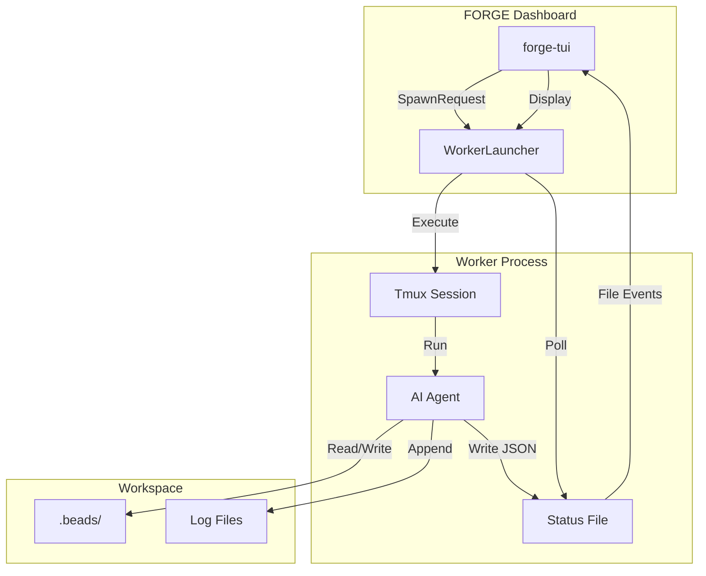
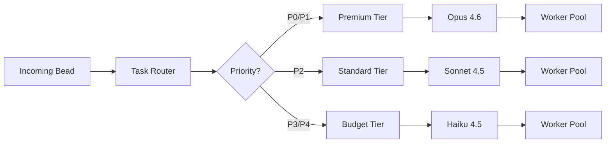

# FORGE Worker System

## Overview

FORGE workers are autonomous AI coding agents that run in isolated tmux sessions. The worker system handles spawning, monitoring, and managing these agents through a combination of launcher scripts, tmux integration, and status file watching.

## Worker Architecture



## Worker Lifecycle

### 1. Spawn Request

The TUI initiates worker spawning through `WorkerLauncher`:

```rust
use forge_worker::{WorkerLauncher, LaunchConfig, SpawnRequest};
use forge_core::types::WorkerTier;

let config = LaunchConfig::new(
    "/home/coder/.forge/launchers/claude-launcher",
    "forge-worker-alpha",
    "/home/coder/project",
    "sonnet"
)
.with_tier(WorkerTier::Standard)
.with_timeout(60);

let request = SpawnRequest::new("claude-code-sonnet-alpha", config);
let handle = launcher.spawn(request).await?;
```

### 2. Launcher Execution

Launcher are shell scripts that:
1. Accept session name as first argument
2. Create a tmux session with that name
3. Start the AI agent inside the session
4. Output JSON with worker information

**Expected JSON format:**

```json
{
  "pid": 12345,
  "session": "forge-worker-alpha",
  "model": "sonnet",
  "message": "Started successfully",
  "bead_id": "fg-123",
  "bead_title": "Implement feature X"
}
```

**Error format:**

```json
{
  "pid": 0,
  "session": "",
  "error": "Failed to start: API key not found"
}
```

### 3. Session Creation

Tmux session follows naming conventions:

| Pattern | Type | Example |
|---------|------|----------|
| `claude-code-glm-47-*` | GLM-4.7 | `claude-code-glm-47-alpha` |
| `claude-code-sonnet-*` | Sonnet 4.5 | `claude-code-sonnet-bravo` |
| `claude-code-opus-*` | Opus 4.6 | `claude-code-opus-charlie` |

### 4. Worker Initialization

Worker agents initialize with environment variables:

| Variable | Purpose | Example |
|----------|---------|----------|
| `FORGE_WORKER_ID` | Unique identifier | `claude-code-sonnet-alpha` |
| `FORGE_SESSION` | Tmux session name | `forge-worker-alpha` |
| `FORGE_MODEL` | Model to use | `sonnet` |
| `FORGE_WORKSPACE` | Working directory | `/home/coder/project` |

### 5. Status Reporting

Workers write status to JSON files in `~/.forge/status/`:

```json
{
  "worker_id": "claude-code-sonnet-alpha",
  "status": "active",
  "current_task": "fg-123: Implement feature X",
  "model": "sonnet",
  "tier": "standard",
  "pid": 12345,
  "started_at": "2025-01-15T10:30:00Z",
  "last_update": "2025-01-15T10:35:00Z"
}
```

### 6. Discovery and Monitoring

FORGE discovers active workers via tmux:

```bash
tmux list-sessions -F '#{session_name}:#{session_created}:...'
```

The `discover_workers()` function parses output to find worker sessions.

## Worker Types

### Supported Executors

| Executor | Model | Tier | Use Case |
|----------|--------|-------|-----------|
| GLM-4.7 | glm-4.7 | Budget/Standard | General tasks via z.ai proxy |
| Sonnet 4.5 | claude-sonnet | Standard | Most tasks |
| Opus 4.6 | claude-opus | Premium | Complex/critical tasks |
| Haiku 4.5 | claude-haiku | Budget | Simple/quick tasks |

### Worker Tiers

Workers are grouped into cost/performance tiers:

```rust
pub enum WorkerTier {
    Premium,  // Opus - for P0/P1 critical tasks
    Standard,  // Sonnet/GLM - for P2 normal tasks
    Budget,    // Haiku - for P3/P4 low-priority tasks
}
```

**Priority to Tier mapping:**
- P0, P1 → Premium tier
- P2 → Standard tier
- P3, P4 → Budget tier

## Worker Status

### Status Values

| Status | Healthy? | Description |
|--------|-----------|-------------|
| `Active` | ✅ Yes | Working on a task |
| `Idle` | ✅ Yes | Running but no current task |
| `Starting` | ✅ Yes | Initializing |
| `Paused` | ✅ Yes | Not claiming new tasks |
| `Failed` | ❌ No | Crashed or error state |
| `Stopped` | ❌ No | Intentionally stopped |
| `Error` | ❌ No | Status file corrupted |

### Status Indicators

Each status has an emoji indicator for TUI display:
- Active: ✅
- Idle: 💤
- Failed: ❌
- Stopped: ⏹️
- Error: ⚠️
- Starting: 🔄
- Paused: ⏸️

## Bead Integration

Workers integrate with the beads task tracking system.

### Bead Queue Reading

Workers can read from workspace bead queues:

```rust
use forge_worker::BeadQueueReader;

let reader = BeadQueueReader::new("/workspace/path")?;
let ready_beads = reader.read_ready_beads()?;
```

### Bead Assignment

Workers can be spawned with bead assignments:

```rust
let config = LaunchConfig::new(/* ... */)
    .with_bead("fg-123");

// Worker receives FORGE_ASSIGNED_BEAD or --bead-ref
```

### Bead Status Updates

Workers update bead status via CLI:
- Mark as in_progress when started
- Close when completed
- Create dependencies if blocked

## Health Monitoring

### Health Checks

The `HealthMonitor` tracks worker health:

```rust
use forge_worker::{HealthMonitor, HealthMonitorConfig};

let config = HealthMonitorConfig {
    check_interval_secs: 30,
    stale_threshold_secs: 300,
    max_recovery_attempts: 3,
    memory_limit_mb: 4096,
};

let monitor = HealthMonitor::new(config);
```

### Health Levels

| Level | Condition | Action |
|-------|-----------|--------|
| Healthy | Status file recent, PID valid | None |
| Degraded | Status file stale (>5 min) | Warning alert |
| Critical | PID dead, session gone | Attempt recovery |
| Failed | Recovery failed | Notify user |

### Recovery Actions

1. **Restart worker**: Re-launch with same config
2. **Mark failed**: Update status to Failed
3. **Notify**: Create alert in TUI

## Tmux Integration

### Session Management

```bash
# List sessions
tmux list-sessions

# Attach to session
tmux attach-session -t forge-worker-alpha

# Detach from session
tmux detach-session

# Kill session
tmux kill-session -t forge-worker-alpha
```

### Session Naming

```rust
// Session name generation
let session_name = format!("forge-worker-{}", id);

// Discovery pattern
let pattern = r"^(claude-code-(glm-47|sonnet|opus)-[a-z]+)$";
```

## Task Routing

### Router Architecture



### Scoring System

Tasks are scored for optimal worker assignment:

```rust
use forge_worker::{TaskScorer, ScoreComponents};

let scorer = TaskScorer::new();
let scored = scorer.score_bead(&bead, &available_workers)?;

// Score components:
// - Priority: 0-40 points
// - Complexity: estimated from description
// - Type: bug (30), feature (20), etc.
// - Worker availability: immediate vs queued
```

### Routing Decision

```rust
pub struct RoutingDecision {
    pub chosen_worker: WorkerId,
    pub model: String,
    pub reason: RoutingReason,
    pub estimated_cost: f64,
}

pub enum RoutingReason {
    PriorityMatch,     // High priority → premium model
    CostOptimization,  // Low priority → budget model
    Availability,       // Worker ready now
    Specialized,        // Worker has relevant experience
    Fallback,          // No ideal match, using available
}
```

## Performance Metrics

### Worker Efficiency

```rust
pub struct WorkerEfficiency {
    pub worker_id: String,
    pub call_count: i64,
    pub total_cost_usd: f64,
    pub total_tokens: i64,
    pub avg_cost_per_call: f64,
    pub avg_tokens_per_call: f64,
    pub efficiency_score: f64,  // tokens / dollar
    pub last_active: DateTime<Utc>,
    pub tier: WorkerTier,
}
```

### Model Performance

```rust
pub struct ModelPerformance {
    pub model: String,
    pub call_count: i64,
    pub total_tokens: i64,
    pub total_cost_usd: f64,
    pub avg_cost_per_1k_tokens: f64,
    pub avg_latency_ms: Option<f64>,
    pub cache_hit_rate: Option<f64>,
}
```

## Error Handling

### Spawn Failures

```rust
use forge_worker::LauncherError;

match launcher.spawn(request).await {
    Ok(handle) => {
        println!("Worker spawned: {}", handle.id);
    }
    Err(LauncherError::LauncherFailed { message }) => {
        eprintln!("Launcher failed: {}", message);
    }
    Err(LauncherError::Timeout { secs }) => {
        eprintln!("Spawn timeout after {}s", secs);
    }
    Err(LauncherError::SessionCreationFailed { session_name }) => {
        eprintln!("Tmux session creation failed: {}", session_name);
    }
}
```

### Worker Crashes

1. Status watcher detects stale file (> 5 min old)
2. Health check confirms PID dead
3. Status updated to Failed
4. Alert created in TUI
5. Optional: Auto-restart if configured

## Configuration

### Launcher Script Template

```bash
#!/usr/bin/env bash
set -euo pipefail

# Arguments
SESSION_NAME="$1"
FORGE_WORKER_ID="${FORGE_WORKER_ID:-worker-default}"
FORGE_MODEL="${FORGE_MODEL:-sonnet}"

# Create tmux session
tmux new-session -d -s "$SESSION_NAME"

# Start agent in session
tmux send-keys -t "$SESSION_NAME" \
    "cd $FORGE_WORKSPACE && $AGENT_COMMAND" Enter

# Output success JSON
cat <<EOF
{
  "pid": $(tmux display-message -p -t "$SESSION_NAME" -F "#{session_pid}"),
  "session": "$SESSION_NAME",
  "model": "$FORGE_MODEL"
}
EOF
```

### Worker Configuration

```yaml
# ~/.forge/workers.yaml
workers:
  claude-code-sonnet-alpha:
    model: sonnet
    tier: standard
    workspace: /home/coder/project
    launcher: ~/.forge/launchers/claude-launcher
```

## API Reference

### WorkerLauncher

```rust
impl WorkerLauncher {
    pub fn new() -> Self;

    pub async fn spawn(&self, request: SpawnRequest)
        -> Result<WorkerHandle, LauncherError>;

    pub async fn stop(&self, worker_id: &WorkerId)
        -> Result<(), LauncherError>;

    pub async fn check_status(&self, worker_id: &WorkerId)
        -> Result<WorkerStatus, LauncherError>;

    pub async fn list_workers(&self)
        -> Result<Vec<WorkerHandle>, LauncherError>;
}
```

### Discovery Functions

```rust
pub async fn discover_workers()
    -> Result<DiscoveryResult, DiscoveryError>;

pub struct DiscoveryResult {
    pub workers: Vec<DiscoveredWorker>,
}

pub struct DiscoveredWorker {
    pub session_name: String,
    pub worker_id: WorkerId,
    pub worker_type: WorkerType,
    pub is_attached: bool,
    pub created_at: DateTime<Utc>,
}
```

## Related Documentation

- [Architecture Overview](./ARCHITECTURE.md) - System design
- [Database Schema](./DATABASE.md) - Cost tracking
- [Events](./EVENTS.md) - Event flow
