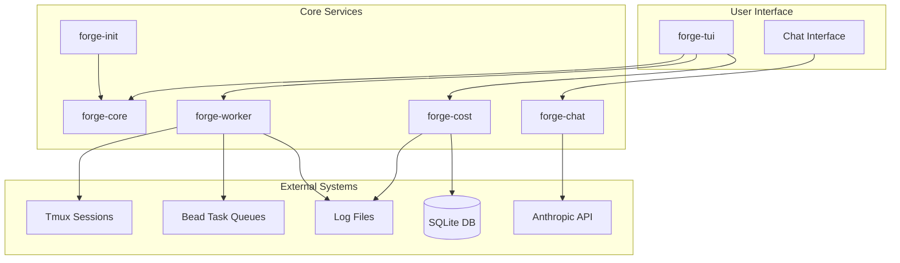
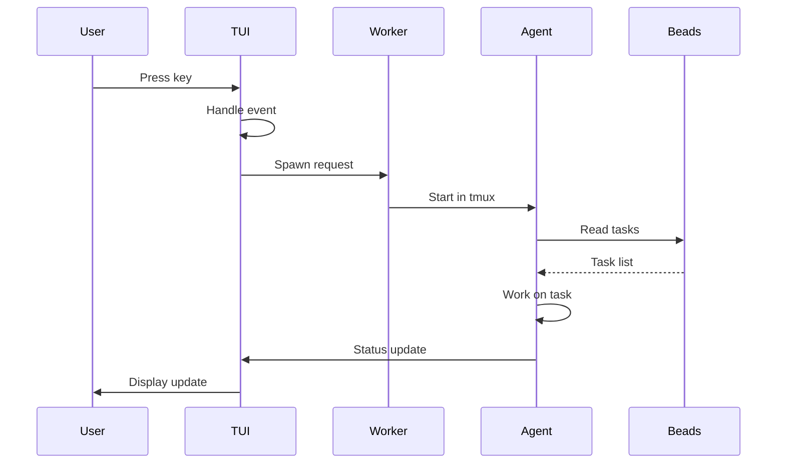
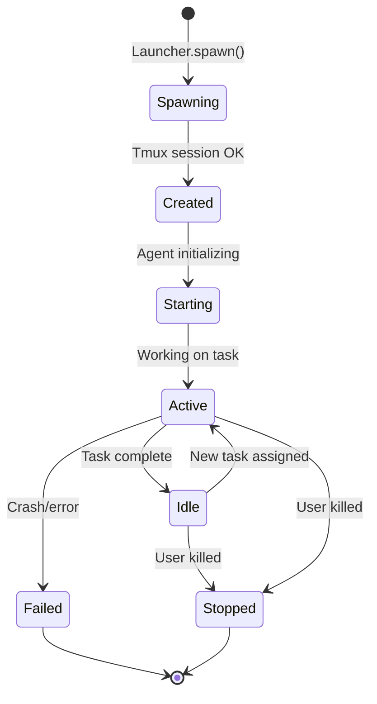
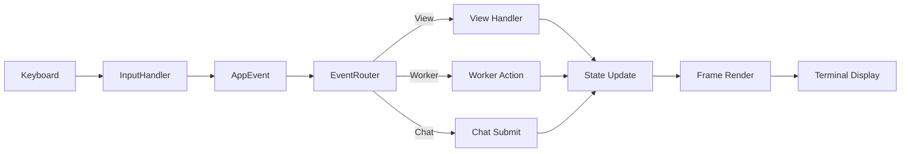

# FORGE Architecture Diagrams

This directory contains Mermaid diagrams illustrating FORGE's system architecture.

## Available Diagrams

- [architecture.md](./architecture.md) - High-level system architecture
- [data-flow.md](./data-flow.md) - Data flow between components
- [worker-lifecycle.md](./worker-lifecycle.md) - Worker spawning and management
- [event-flow.md](./event-flow.md) - Event handling pipeline

## Usage

These diagrams can be viewed in:
- GitHub/GitLab: Native Mermaid rendering
- VS Code: With Mermaid preview extension
- CLI: `mmdc` command to convert to images
- Online: https://mermaid.live

## Diagram: High-Level Architecture

## Diagram: Data Flow

## Diagram: Worker Lifecycle

## Diagram: Event Flow

