# FORGE Architecture Diagrams

This directory contains Mermaid diagrams illustrating FORGE's system architecture.

## Available Diagrams

| File | Description |
|------|-------------|
| [architecture.md](./architecture.md) | High-level system architecture (this file) |
| [data-flow.md](./data-flow.md) | Data flow between components |
| [worker-lifecycle.md](./worker-lifecycle.md) | Worker spawning and management |
| [event-flow.md](./event-flow.md) | Event handling pipeline |

## Usage

These diagrams can be viewed in:
- **GitHub/GitLab**: Native Mermaid rendering
- **VS Code**: With Mermaid preview extension
- **CLI**: `mmdc` command to convert to images
- **Online**: https://mermaid.live

---

## High-Level System Architecture

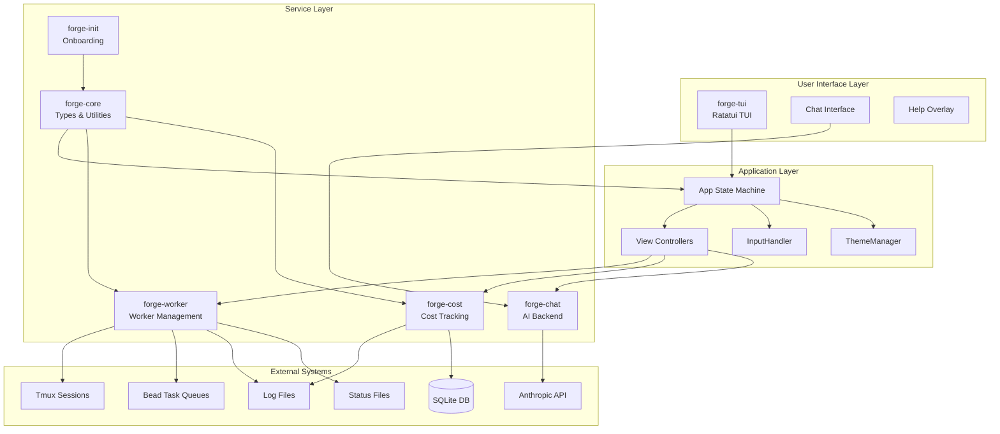

## Crate Dependency Graph

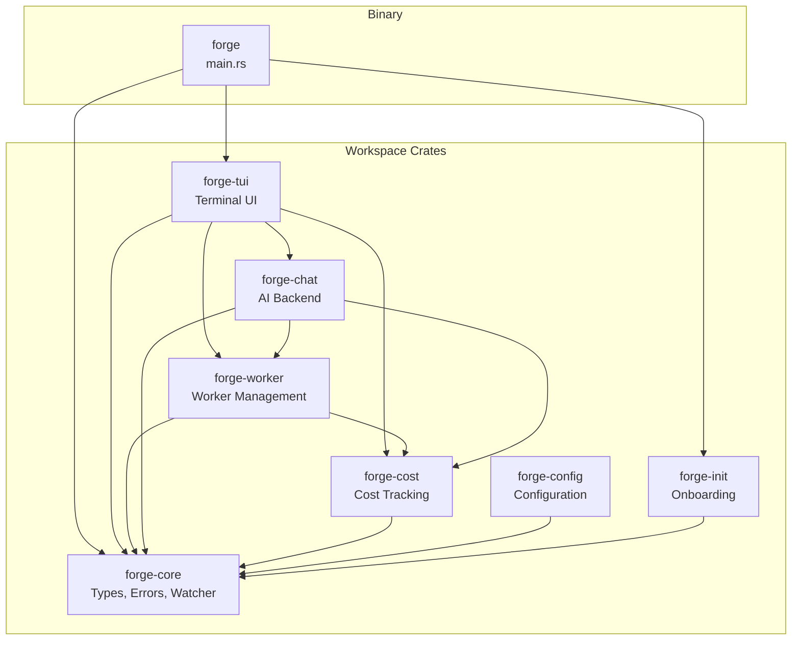

## Component Interaction

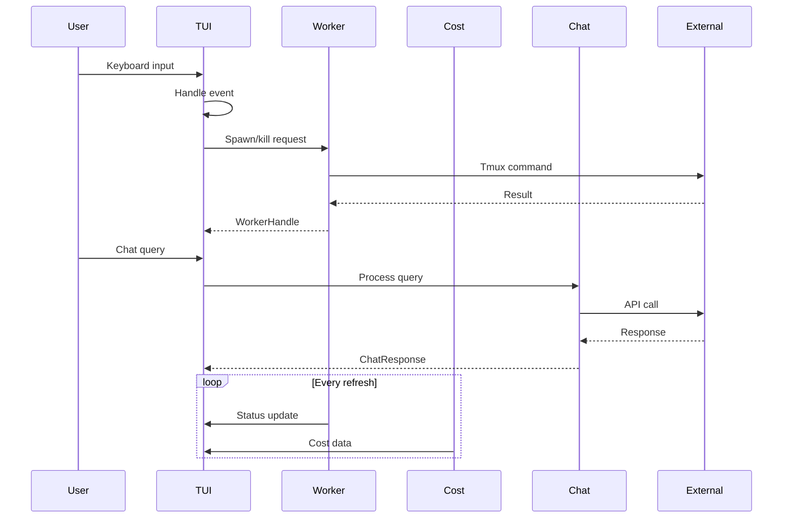

## View System

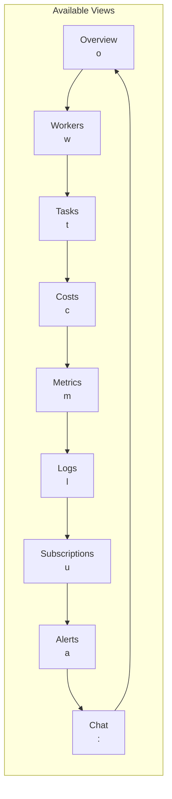

## Layout Modes

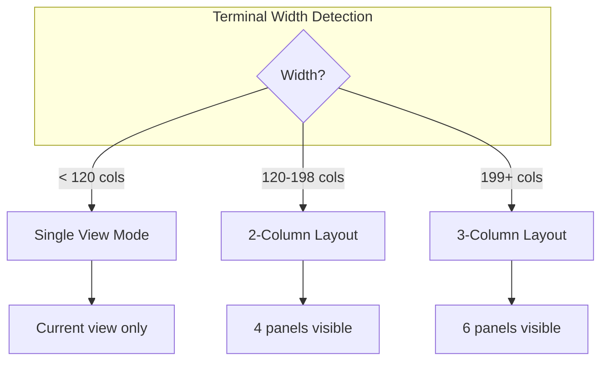

## Data Storage Architecture

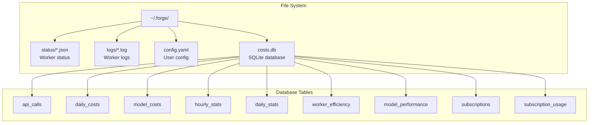

## Chat Backend Architecture

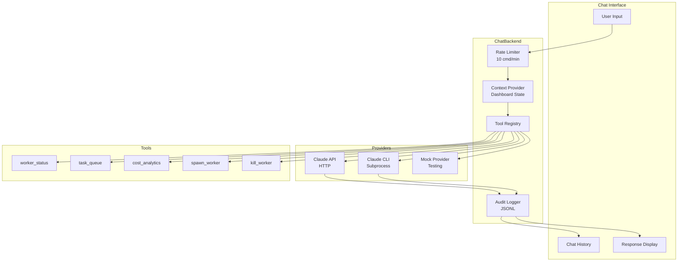

## Health Monitoring

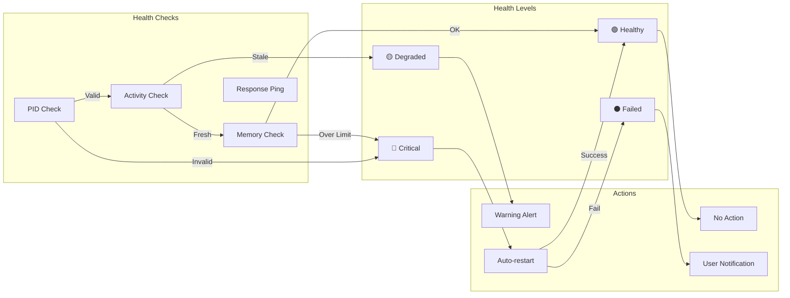

## Task Routing

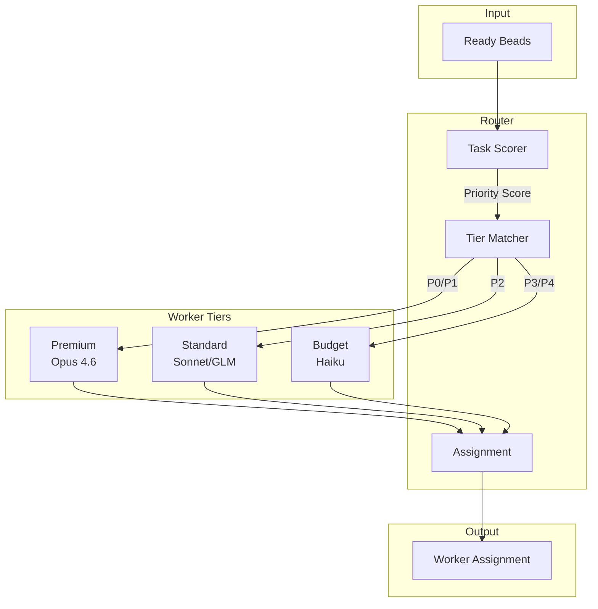

## Error Recovery

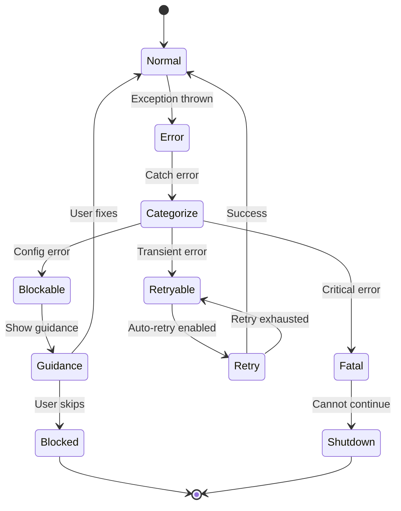

## Configuration Hot-Reload

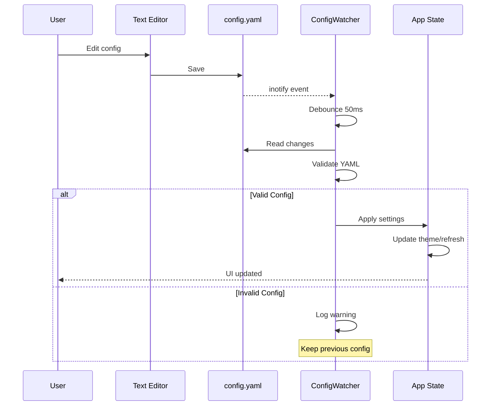

---

## Related Documentation

- [Architecture Documentation](../ARCHITECTURE.md) - Detailed system design
- [Database Schema](../DATABASE.md) - Database documentation
- [Workers System](../WORKERS.md) - Worker management details
- [Events System](../EVENTS.md) - Event handling documentation
- [UI Architecture](../UI.md) - TUI design details
