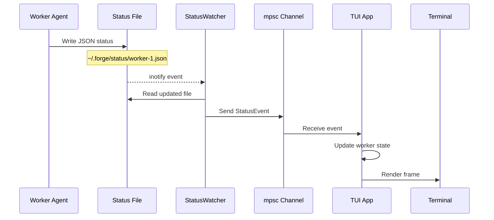
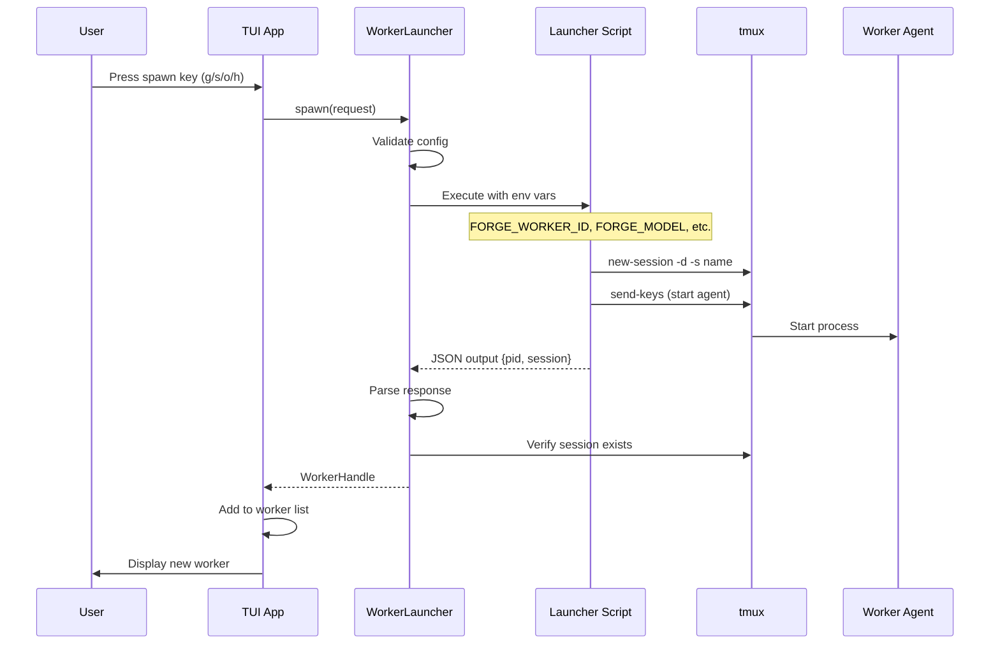
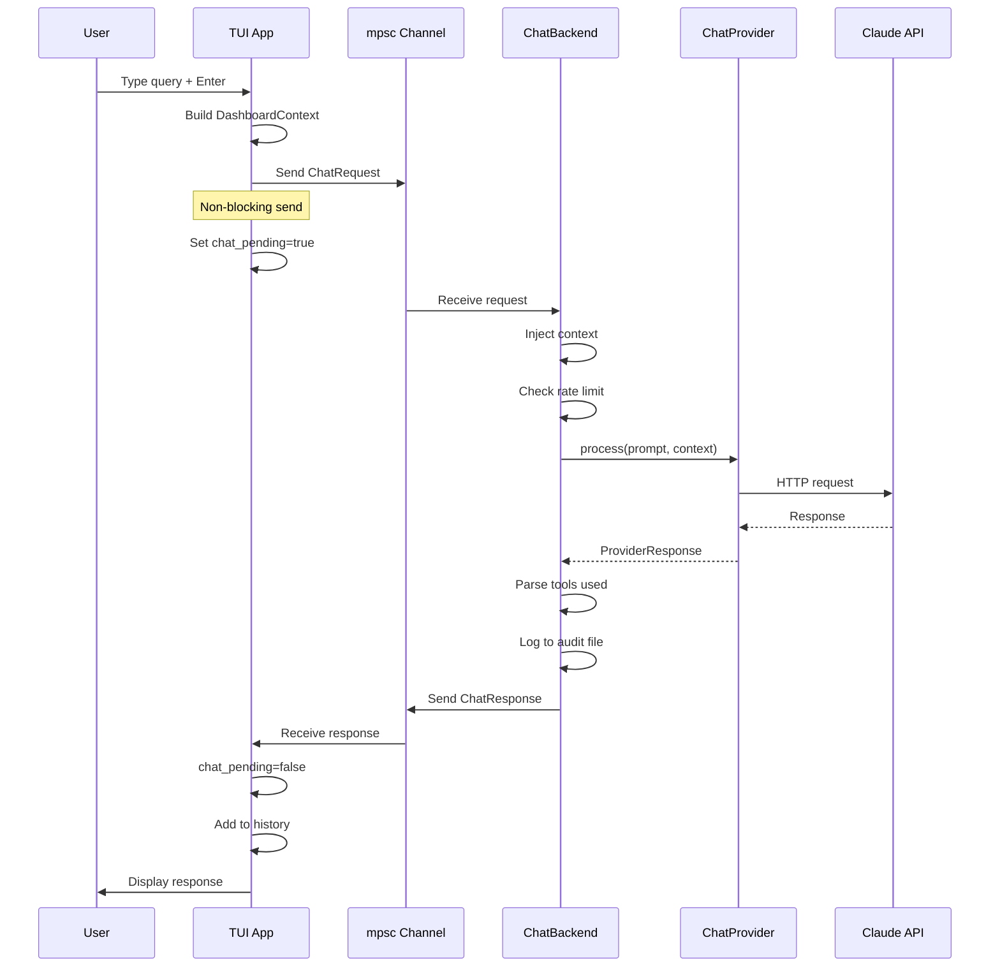
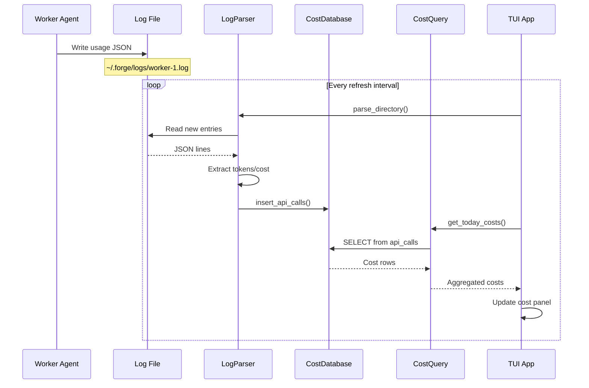
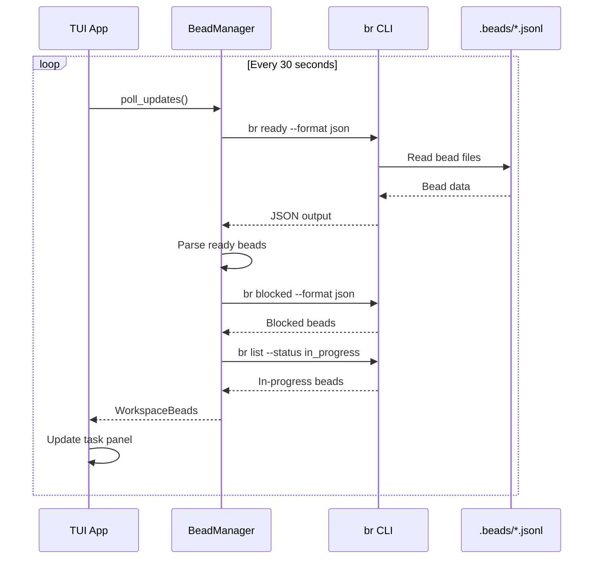
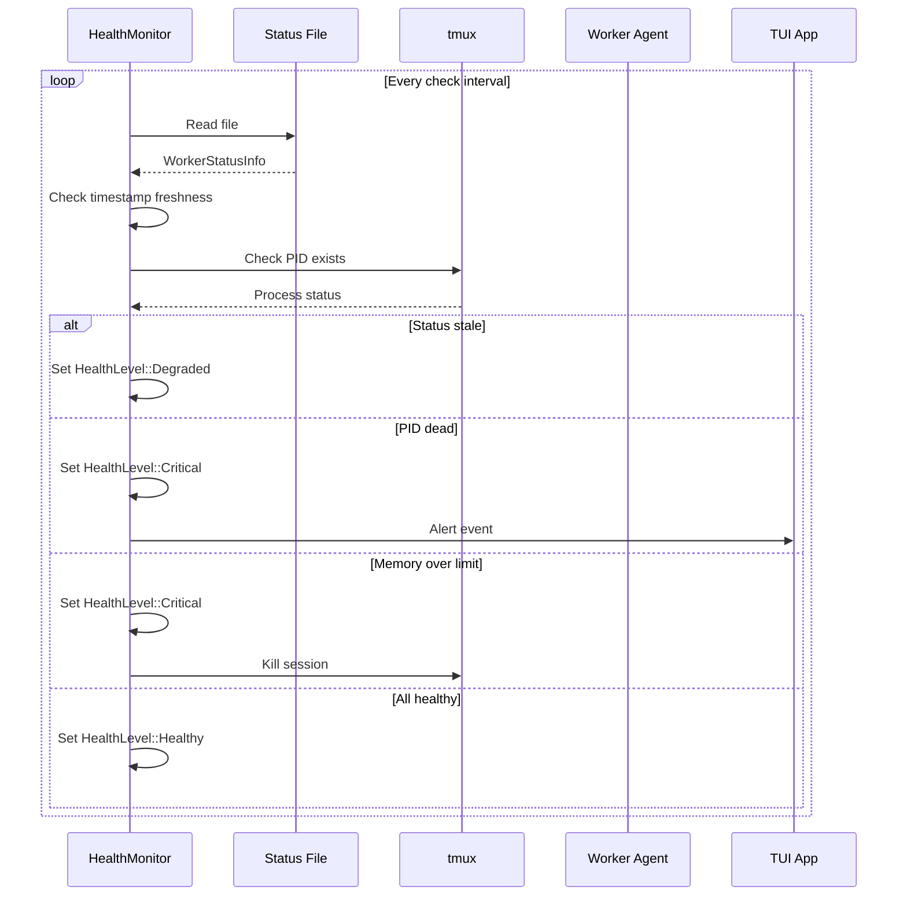
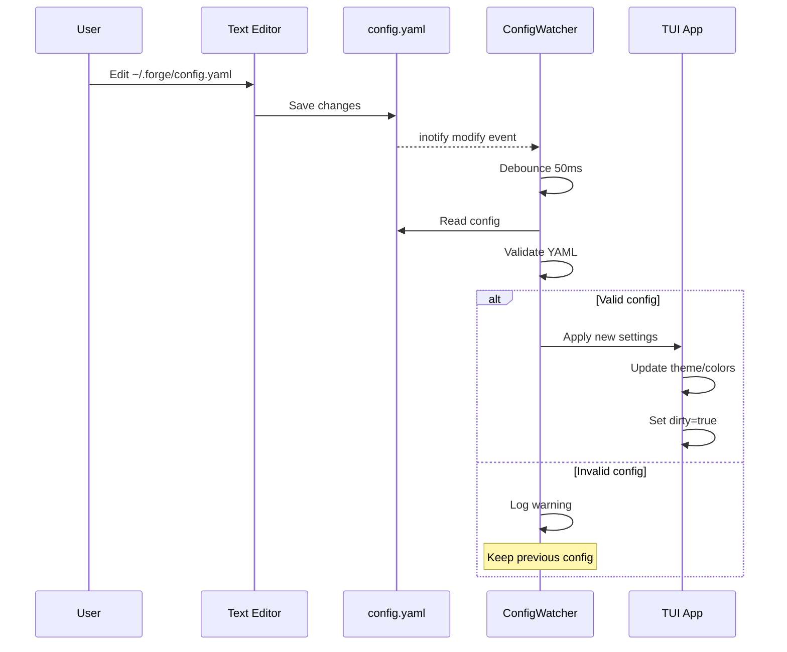
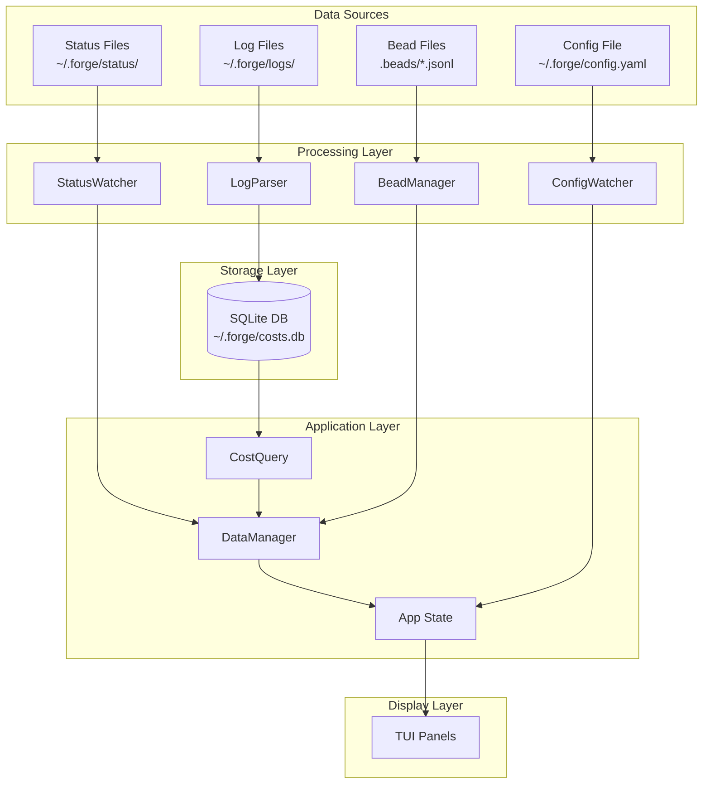

# FORGE Data Flow Diagrams

This document illustrates how data flows through the FORGE system.

## Status Update Flow

When a worker agent updates its status, the data flows as follows:

## Worker Spawn Flow

## Chat Query Flow

## Cost Tracking Flow

## Bead Queue Flow

## Health Check Flow

## Theme Hot-Reload Flow

## Component Data Dependencies

## Related Documentation

- [Architecture Overview](./ARCHITECTURE.md) - System design
- [Worker Lifecycle](./worker-lifecycle.md) - Worker state machine
- [Event Flow](./event-flow.md) - Event handling pipeline
