# FORGE Event Flow Diagrams

This document illustrates how events flow through the FORGE system.

## Event Loop Overview

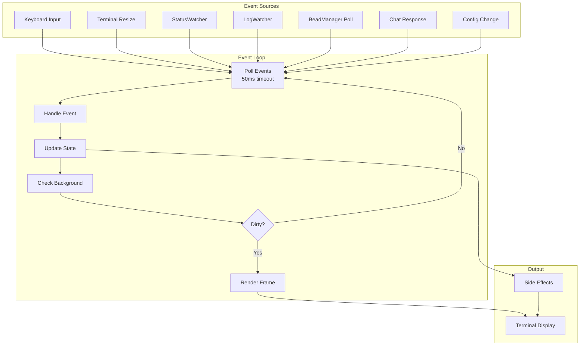

## AppEvent Categories

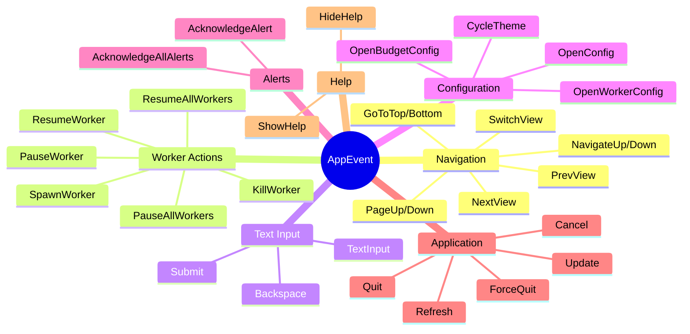

## Input Handling Flow

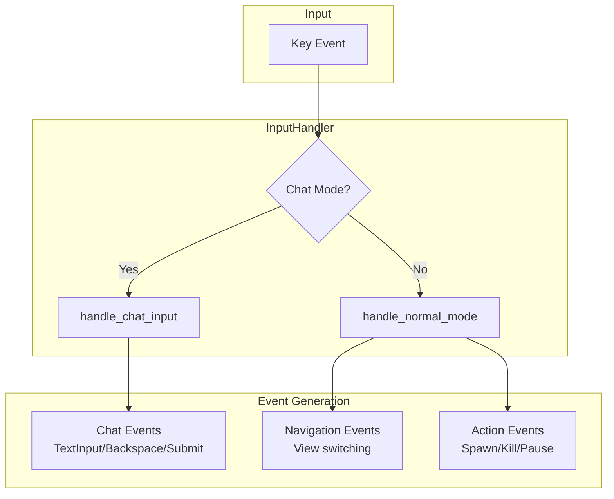

## State Update Flow

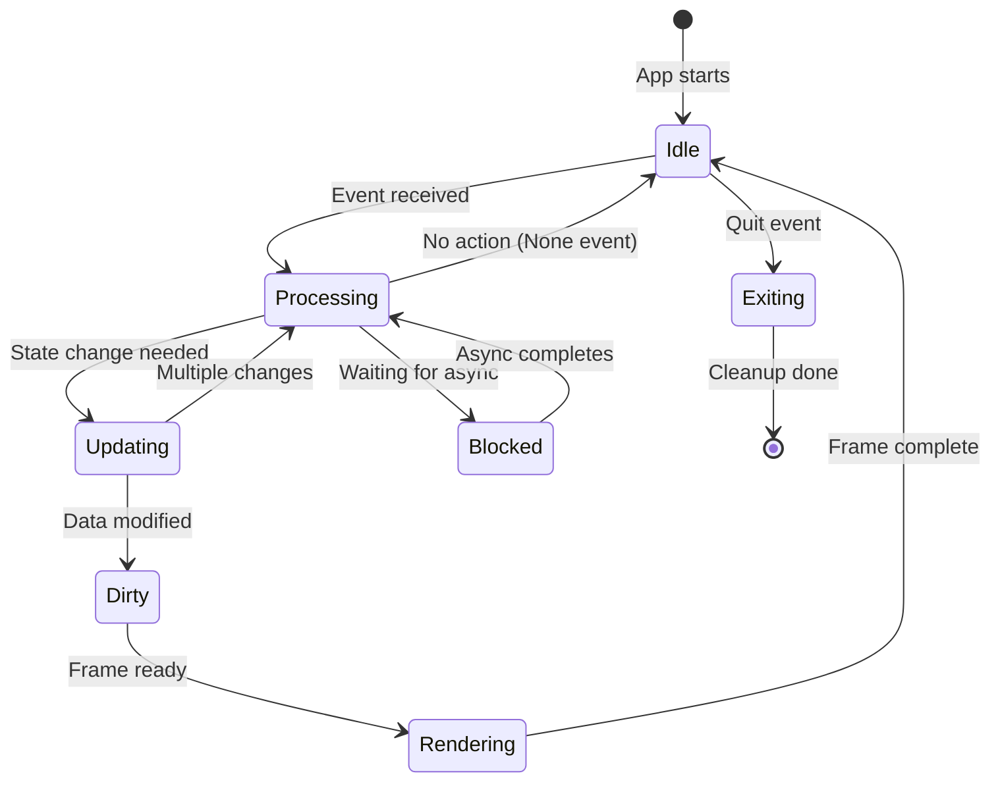

## Dirty Flag Pattern

```mermaid
sequenceDiagram
    participant Loop as Event Loop
    participant App as App State
    participant Render as Renderer
    participant Terminal as Terminal

    Loop->>App: Handle event
    App->>App: Modify data
    App->>App: Set dirty=true

    Loop->>App: Check dirty
    App-->>Loop: dirty=true

    Loop->>Render: render_frame()
    Render->>Terminal: Draw widgets
    Render->>App: Set dirty=false

    Loop->>App: Check dirty
    App-->>Loop: dirty=false

    Note over Loop: Skip render, continue polling
```

## Background Event Sources

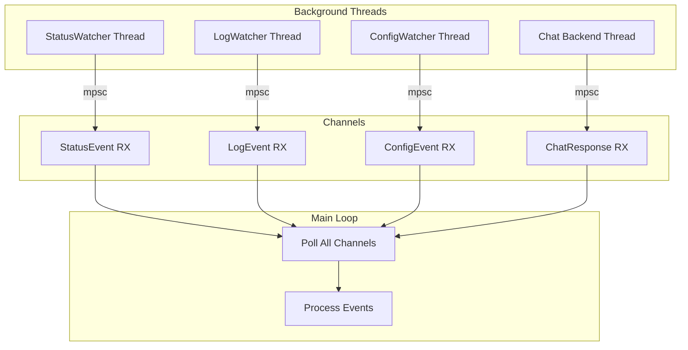

## View-Specific Key Bindings

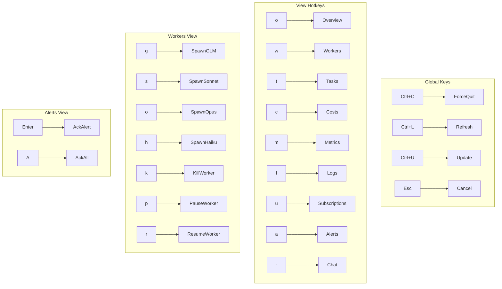

## Chat Event Flow

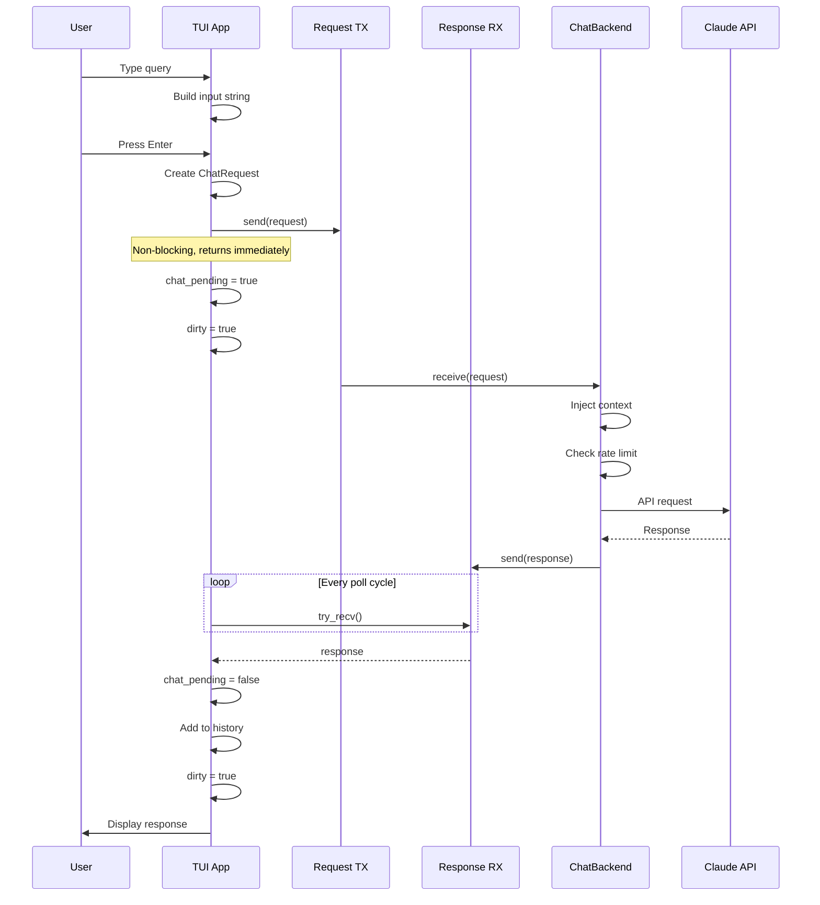

## Status Event Types

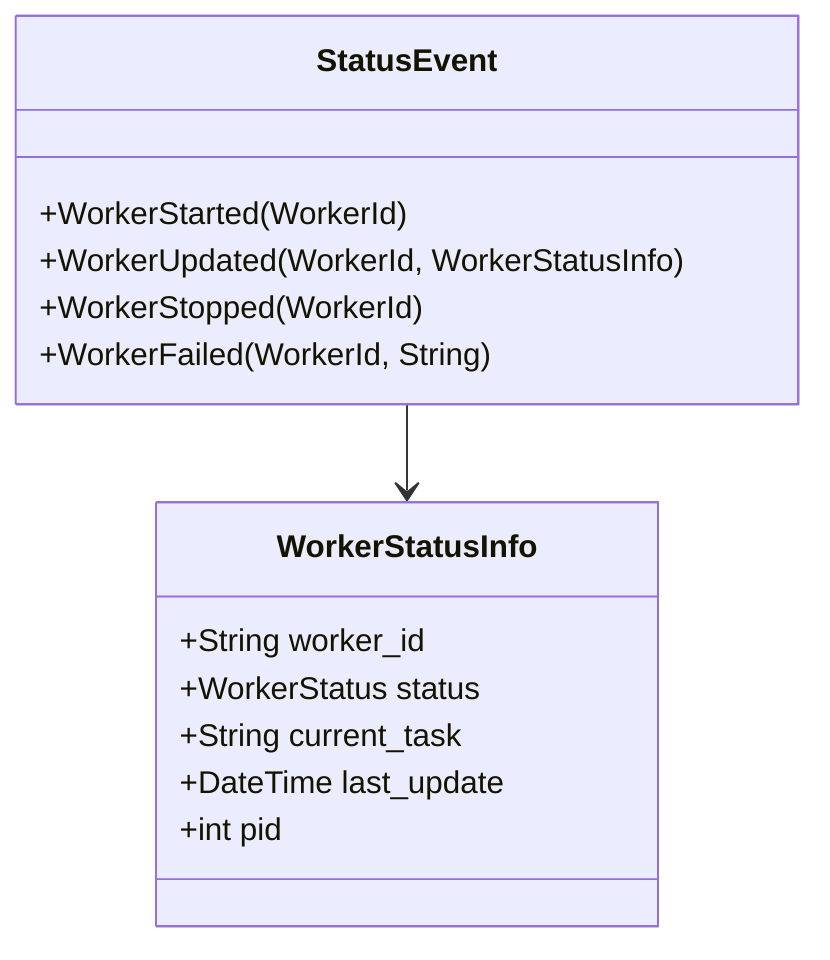

## Log Event Types

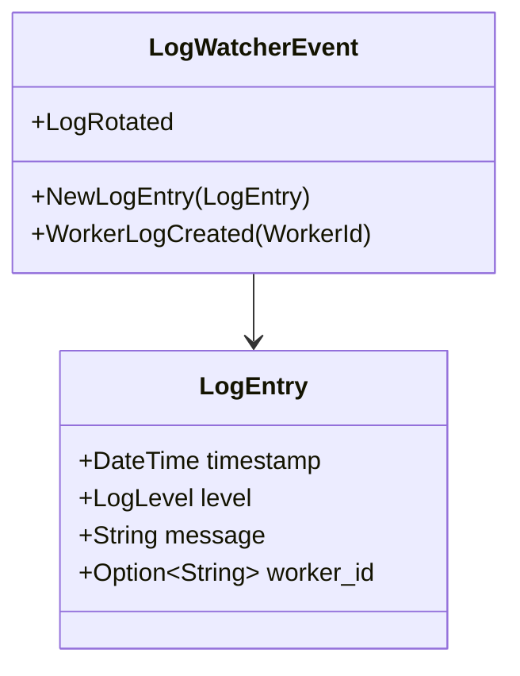

## Bead Event Types

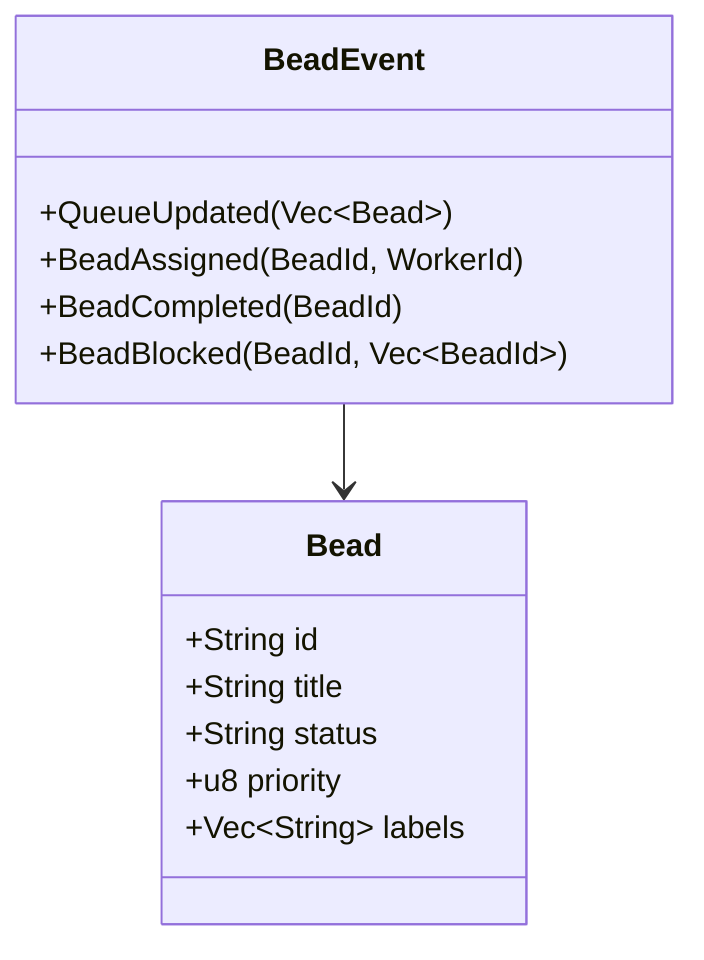

## Error Recovery Events

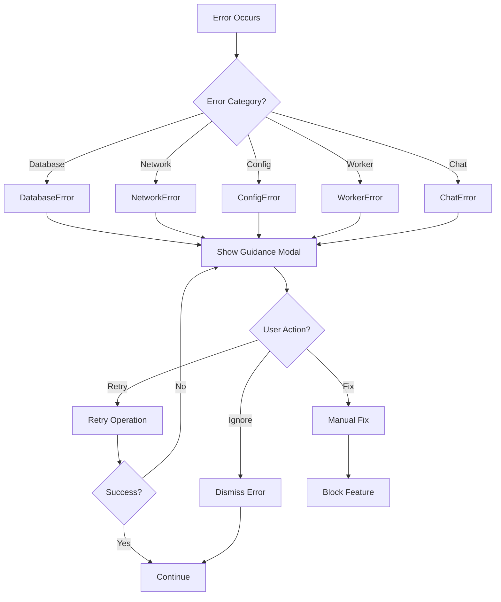

## Event Priority Order

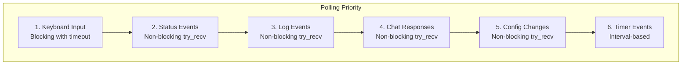

## Timing Targets

| Operation | Target | Notes |
|-----------|--------|-------|
| Key press → Event | < 1ms | Direct mapping |
| State update | < 5ms | In-memory changes |
| Frame render | < 16ms | 60 FPS target |
| Background poll | 50ms timeout | Balance CPU/response |
| Bead poll interval | 30s | External CLI calls |
| Status watch latency | < 100ms | File system events |

## Event Batching

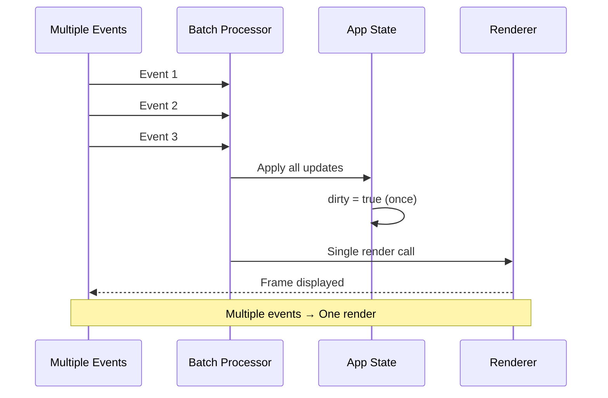

## Related Documentation

- [Architecture Overview](./ARCHITECTURE.md) - System design
- [Events Documentation](../EVENTS.md) - Detailed event docs
- [Data Flow](./data-flow.md) - Data movement
- [Worker Lifecycle](./worker-lifecycle.md) - Worker states
