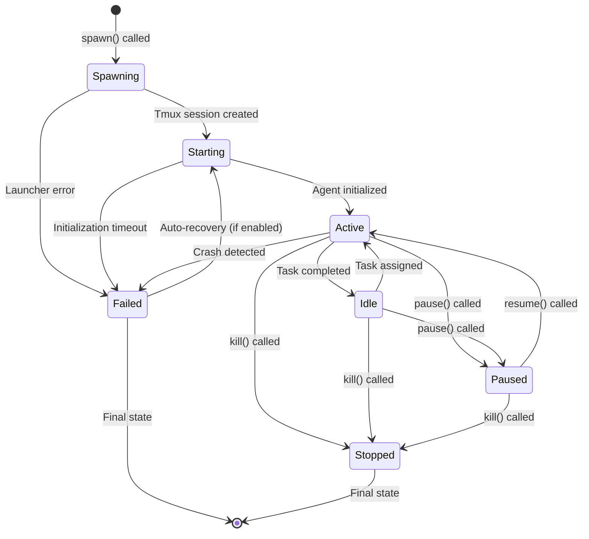
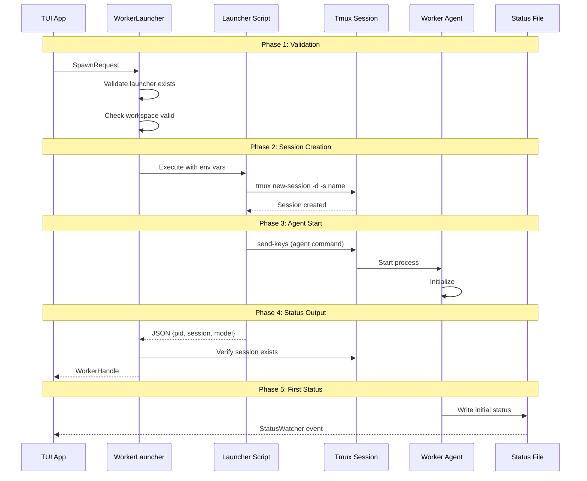
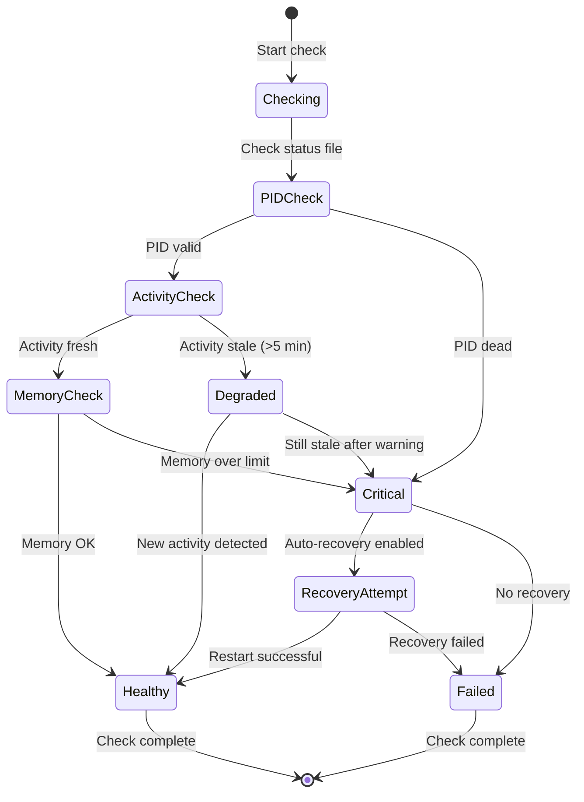
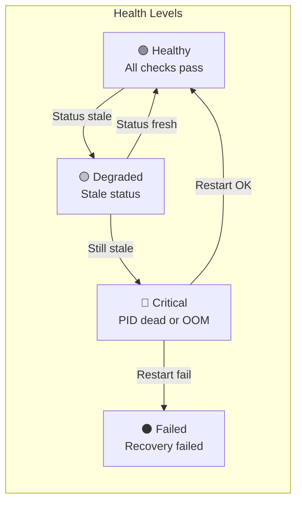
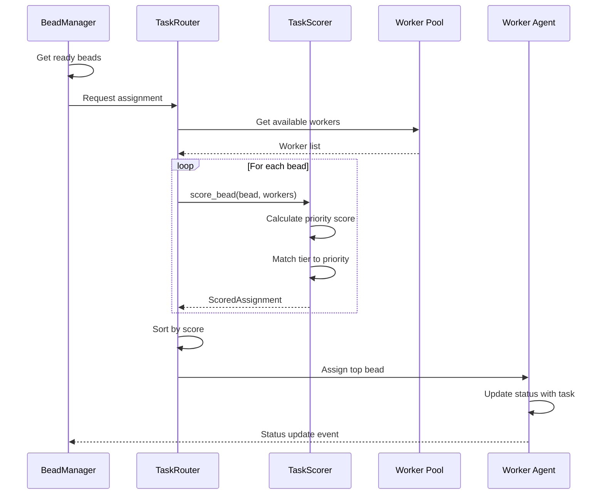
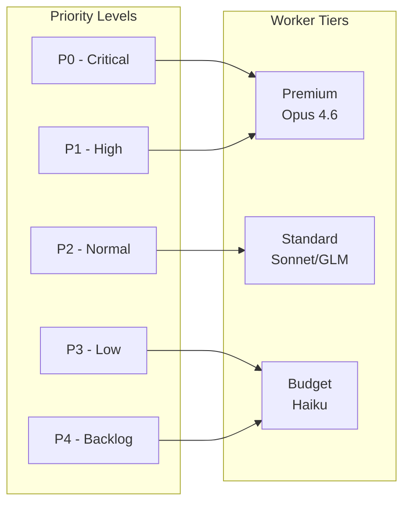
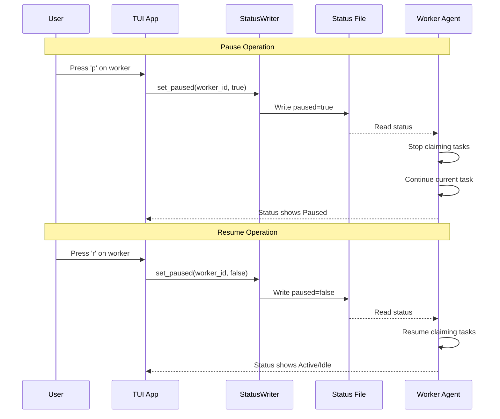
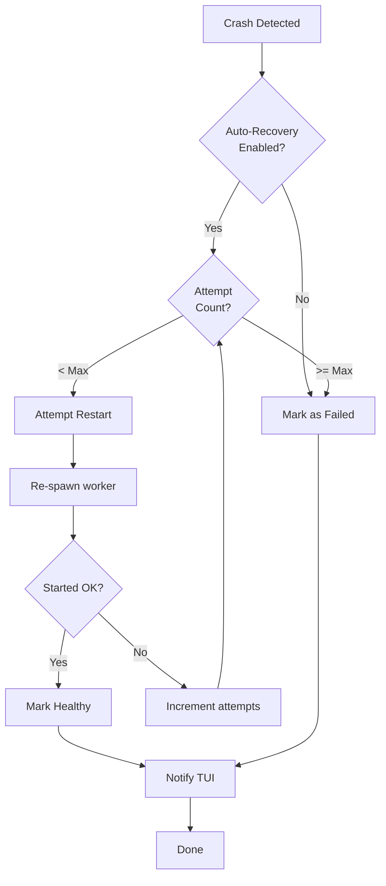
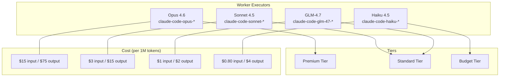
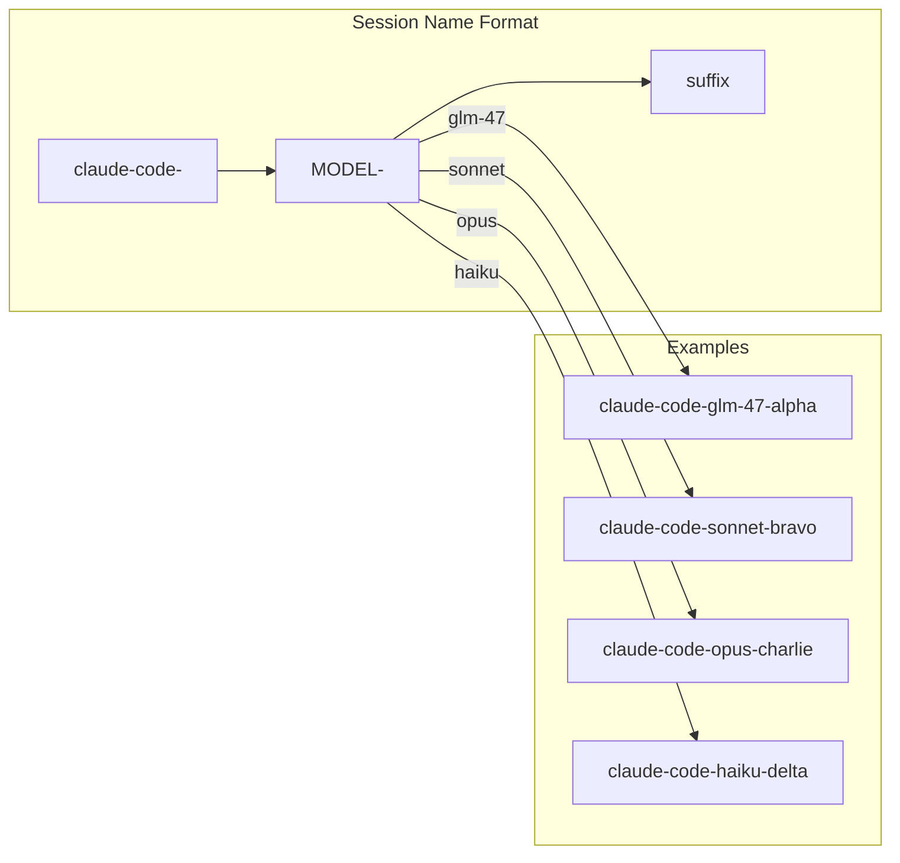

# FORGE Worker Lifecycle Diagrams

This document illustrates the lifecycle and state transitions of FORGE workers.

## Worker State Machine

## Worker Status Values

| Status | Color | Indicator | Description |
|--------|-------|-----------|-------------|
| `Active` | Green | ✅ | Working on a task |
| `Idle` | Gray | 💤 | Running, no current task |
| `Starting` | Yellow | 🔄 | Initializing |
| `Paused` | Blue | ⏸️ | Not claiming new tasks |
| `Failed` | Red | ❌ | Crashed or error state |
| `Stopped` | Dark Gray | ⏹️ | Intentionally stopped |
| `Error` | Orange | ⚠️ | Status file corrupted |

## Spawn Sequence

## Health Check States

## Health Levels

## Task Assignment Flow

## Priority to Tier Mapping

## Pause/Resume Flow

## Recovery Flow

## Worker Types

## Session Naming Convention

## Environment Variables

| Variable | Example | Description |
|----------|---------|-------------|
| `FORGE_WORKER_ID` | `claude-code-sonnet-alpha` | Unique worker identifier |
| `FORGE_SESSION` | `forge-worker-alpha` | Tmux session name |
| `FORGE_MODEL` | `sonnet` | Model to use |
| `FORGE_WORKSPACE` | `/home/coder/project` | Working directory |
| `FORGE_ASSIGNED_BEAD` | `fg-123` | Assigned bead ID (optional) |

## Related Documentation

- [Architecture Overview](./ARCHITECTURE.md) - System design
- [Data Flow](./data-flow.md) - Data movement
- [Event Flow](./event-flow.md) - Event handling
- [Workers Documentation](../WORKERS.md) - Detailed worker docs
